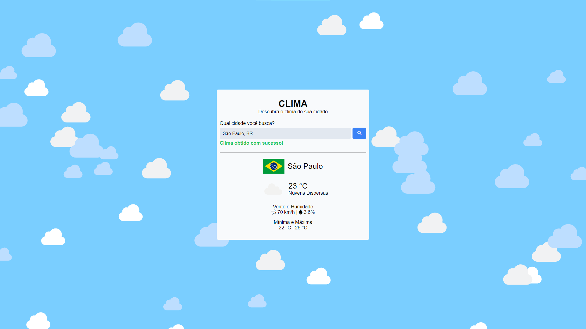

# Clima

### [Visitar Projeto](https://clima-luiz2k.vercel.app/)

---

## 📝 Sobre
Projeto consumindo a **Weather API**. Através dessa API é possível obter o clima da cidade informada. Quando consumida a API, ela retorna dados como, o clima atual, a mínima e máxima, vento e humidade.

## 🛠️ Tecnologias
Projeto desenvolvido utilizando as seguintes tecnologias:
- HTML
- CSS
- JavaScript
- TypeScript

---

Projeto desenvolvido por [Luiz Teles](#)